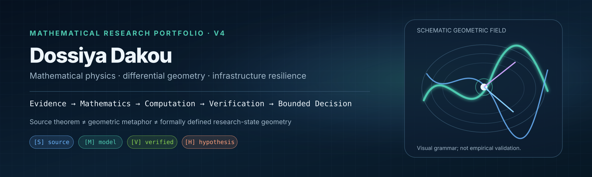
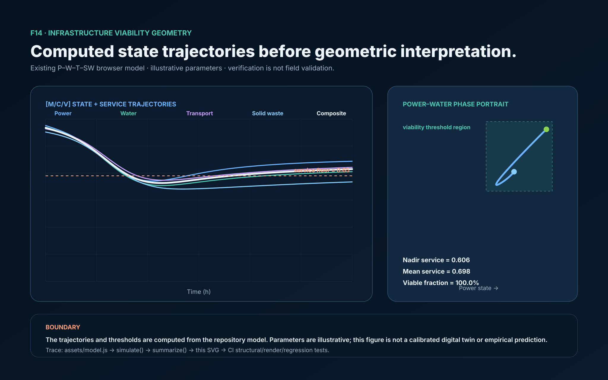

# Dossiya Dakou — Mathematical Research Portfolio

[](https://github.com/Dossiya-SE/dossiya-se.github.io/actions/workflows/verify.yml)
[](https://github.com/Dossiya-SE/dossiya-se.github.io/actions/workflows/production-audit.yml)

**Live mathematical laboratory:** https://dossiya-se.github.io/

<p align="center"></p>

## Mathematical Art V4

The portfolio now has a governed F01–F14 visual system. Every figure is tied to a registry entry and scientific manifest; computed differential-geometry figures are generated from equations and tested against independent analytic/numerical oracles.

**[Open the complete F01–F14 mathematical-art gallery and reproducibility contract](mathematical-art/README.md)**

The governing visual pipeline is:

```text
Evidence → Mathematics → Computation → Geometry → Visual Encoding → Layout → Rendering → Verification → Publication Artifact
```

The release rule remains strict: a visually complete candidate is not called `RELEASED` until its mandatory manifest gates pass.

<p align="center"></p>

## What the infrastructure visual corresponds to in code

| Visual object | Executable evidence |
|---|---|
| coupled P–W–T–SW state | `assets/model.js` |
| RK4 trajectories | numerical core + model tests |
| inverse recovery | seeded synthetic inverse experiment |
| uncertainty envelope | seeded Monte Carlo experiment |
| viability margin/time | threshold-crossing time integration |
| F14 vector figure | `scripts/generate-f14.mjs` + deterministic regression |
| differential-geometry figures F08–F13 | `scripts/generate-dg-figures.py` + oracle/regression tests |
| interactive network / field | D3 + native WebGL |
| verification lattice | `tests/`, `scripts/verify.mjs`, mathematical-art release audit |

The reduced demonstrator is

```math
\dot{x}_i=r_i(1-x_i)+b_i u(1-x_i)-h_i(t)x_i-\sum_{j\ne i}c_{ij}x_i(1-x_j),
\qquad S(t)=w^T x(t).
```

The inverse experiment uses

```math
y_k=S(t_k;\alpha^*)+\varepsilon_k,
\qquad
\hat\alpha=\arg\min_\alpha\sum_k[y_k-S(t_k;\alpha)]^2.
```

The Monte Carlo diagnostic reports an empirical conditional failure estimate

```math
\widehat P_f=N^{-1}\sum_{n=1}^N \mathbf 1\{\min_t S^{(n)}(t)<S_{\min}\}.
```

## Epistemic legend

**A — established mathematics:** RK4, least squares, Monte Carlo.  
**B — implemented research demonstrator:** current browser P–W–T–SW model.  
**C — proposed research object:** sustainable-equitable viability architecture.  
**D — frontier method:** advanced approaches whose presence does not imply validation.

**Boundary:** current parameters are illustrative. Browser output is **not** presented as a calibrated field prediction or validated digital twin.

## Verification ≠ validation

The automated suite checks state bounds, final-horizon handling, service-weight consistency, threshold-crossing time, viability-duration consistency, recovery-control behavior, seeded reproducibility, invalid-sample rejection and synthetic inverse recovery. The V4 visual audit additionally checks figure manifests, canonical viewBoxes, declared layout regions, contrast, typography, deterministic regeneration, high-resolution rasterization, and production structure.

```bash
npm test
npm run verify:dg
npm run verify:f14
npm run verify:math-art
npm run audit:release
```

Passing these gates verifies implementation properties. Empirical promotion requires:

`source/data → observation model → identification → calibration → out-of-sample validation → UQ → viability/reachability → decision`

## Mathematical knowledge architecture

The D3 mathematics atlas is a **curated conceptual graph**, not a theorem-dependency graph. Formalization references are **MSC2020**, **W3C SKOS** and **W3C PROV-O**. Systems life-cycle structure may reference **ISO/IEC/IEEE 15288:2023** without implying certification.

## Audit trail

[`RESEARCH_RIGOR.md`](RESEARCH_RIGOR.md) · [`AUDIT_REPORT_2026-08-21.md`](AUDIT_REPORT_2026-08-21.md) · [`REFERENCES_2026.md`](REFERENCES_2026.md) · [`research.json`](research.json) · [`mathematical-art/`](mathematical-art/)

> **Research rule:** mathematical consistency, software verification and empirical validation are different claims and are reported separately.
