# Mathematical Art V4 — governed visual system

This directory is the source-of-truth governance layer for the portfolio's mathematical figures.

The required chain is:

```text
Evidence → Mathematics → Computation → Geometry → Visual Encoding → Layout → Rendering → Verification → Publication Artifact
```

A figure is not released because it looks finished. Its registry status and manifest determine whether it is `SPECIFIED`, `DRAFT`, `CANDIDATE`, or `RELEASED`.

## Governing files

- [`figure_registry.json`](figure_registry.json) — authoritative F01–F14 inventory and release status.
- [`design_tokens.json`](design_tokens.json) — canonical canvases, semantic colors, spacing, typography floors, and vector-master policy.
- [`manifests/`](manifests/) — per-figure provenance, mathematical objects, tolerances, exports, and release gates.
- [`../scripts/verify-math-art-v4.mjs`](../scripts/verify-math-art-v4.mjs) — registry/layout/release enforcement.
- [`../scripts/verify-svg-xml.py`](../scripts/verify-svg-xml.py) — XML, typography, and contrast audit.
- [`../scripts/test-dg-math.py`](../scripts/test-dg-math.py) — independent differential-geometry oracles.
- [`../scripts/verify-dg-regression.py`](../scripts/verify-dg-regression.py) — byte-for-byte F08–F13 regeneration.
- [`../scripts/verify-f14-regression.mjs`](../scripts/verify-f14-regression.mjs) — model-to-F14 deterministic regression.

## Scientific boundaries

```text
source differential geometry ≠ geometric metaphor ≠ formally defined research-state geometry
verification ≠ empirical validation
high pixel count ≠ scientific resolution
```

SVG is the canonical master for this diagram family. Raster copies are derivatives used for rendering diagnostics and presentation fallbacks.

## F01–F14 gallery

### F01 — Mathematical Research Header

<p align="center"></p>

### F02 — Profile Mathematics Universe

<p align="center">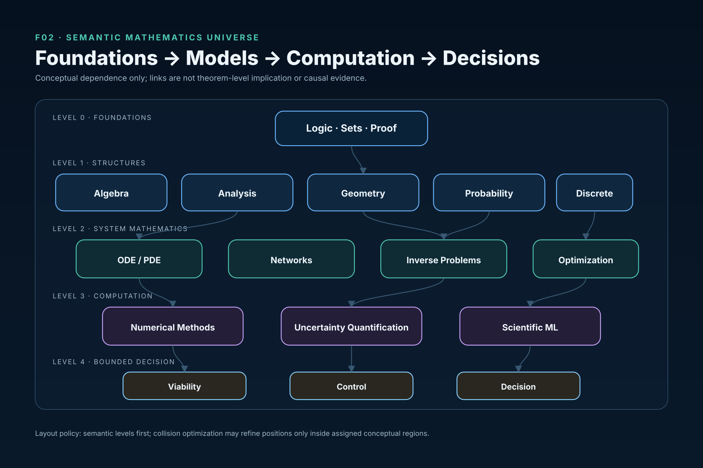</p>

### F03 — Mathematical Research Operating System

<p align="center">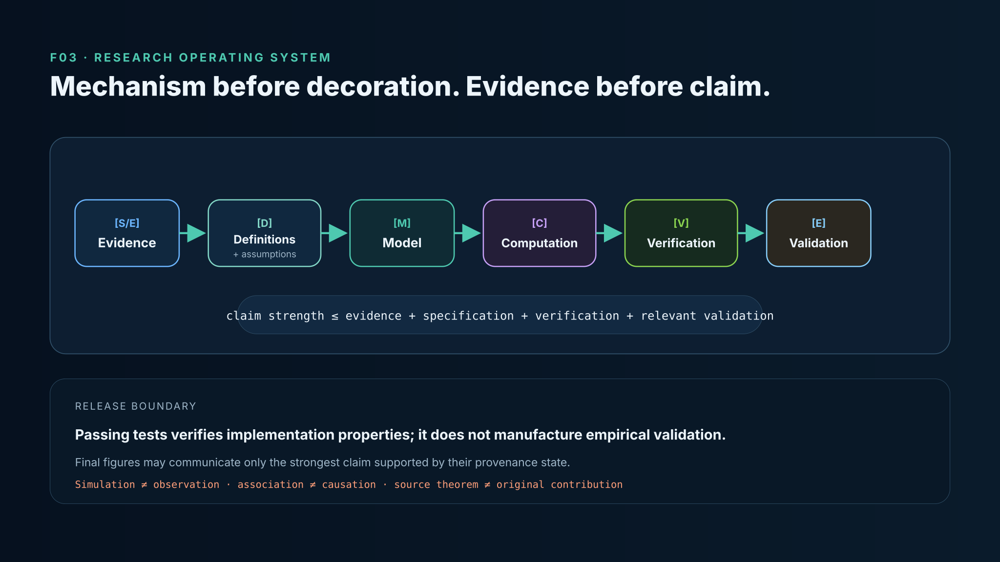</p>

### F04 — Differential Geometry and Research Transfer

<p align="center">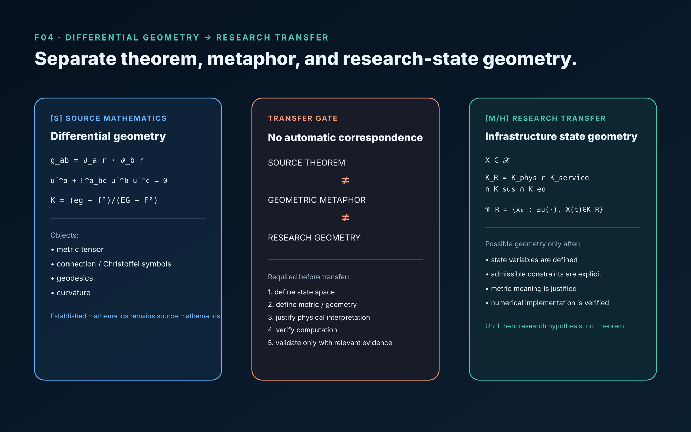</p>

### F05 — Formula Evidence Lattice

<p align="center">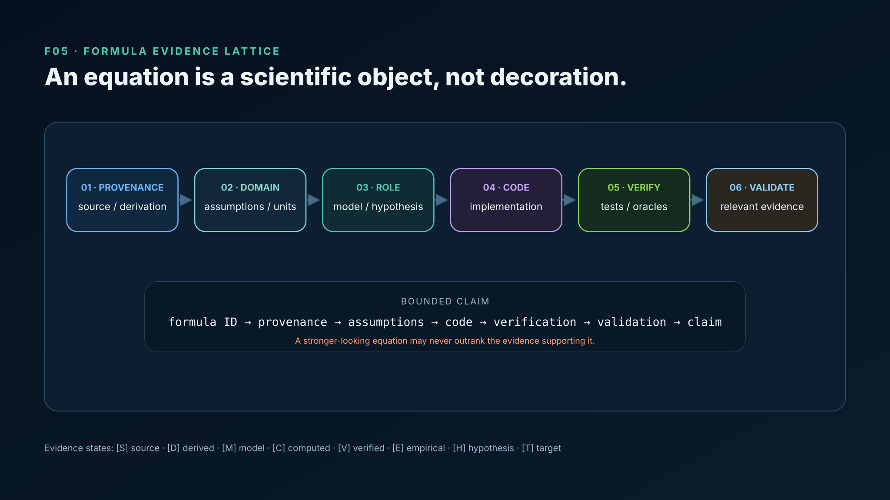</p>

### F06 — Evidence Maturity Map

<p align="center">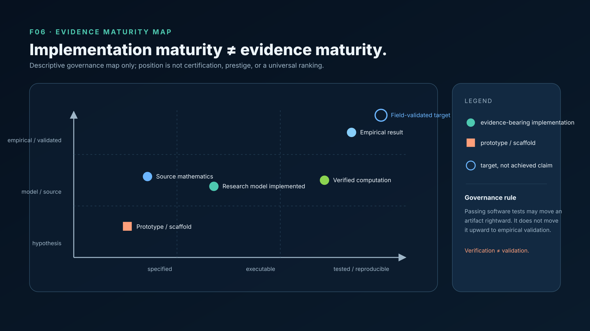</p>

### F07 — Computational Mathematics Stack

<p align="center">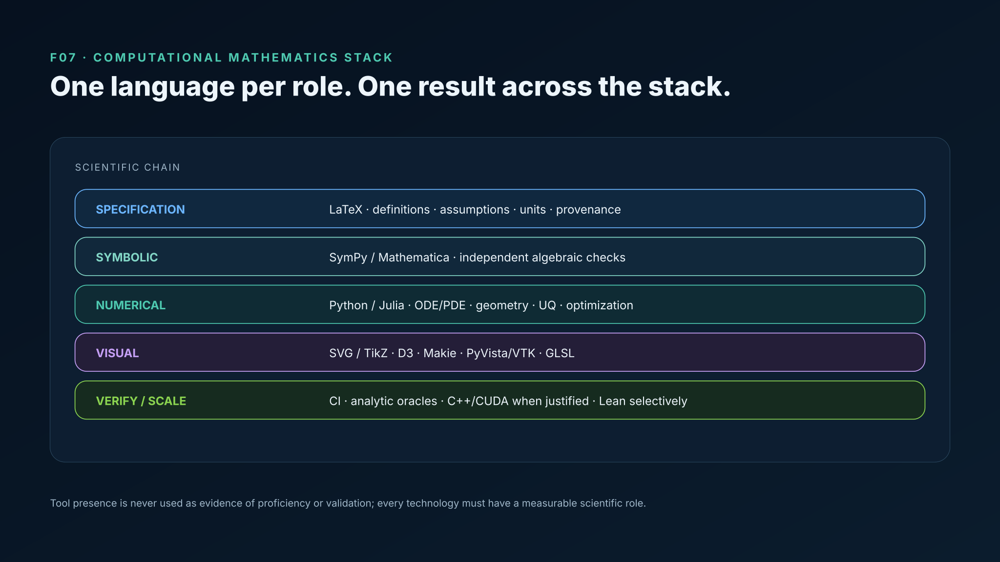</p>

### F08 — Curves and Frenet Frames

<p align="center">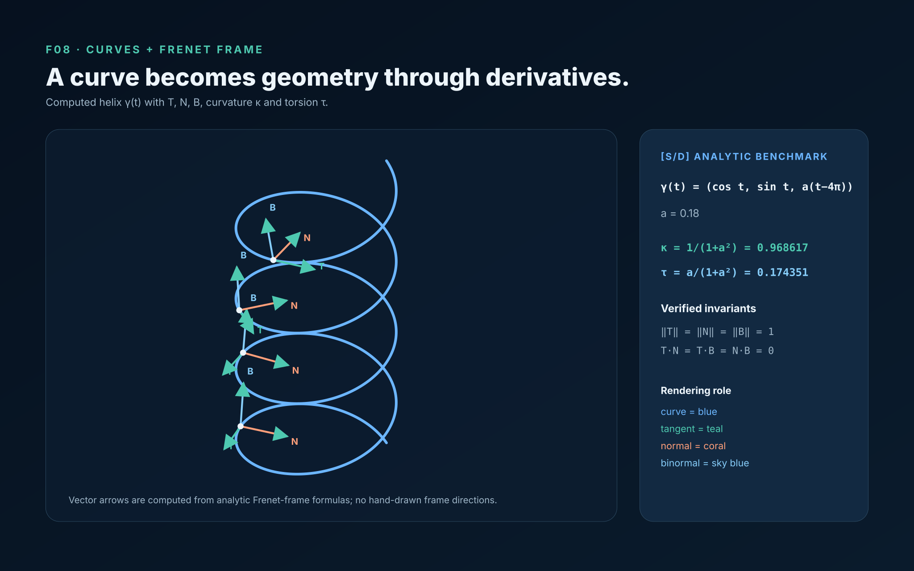</p>

### F09 — Parameterized Surface and Metric

<p align="center">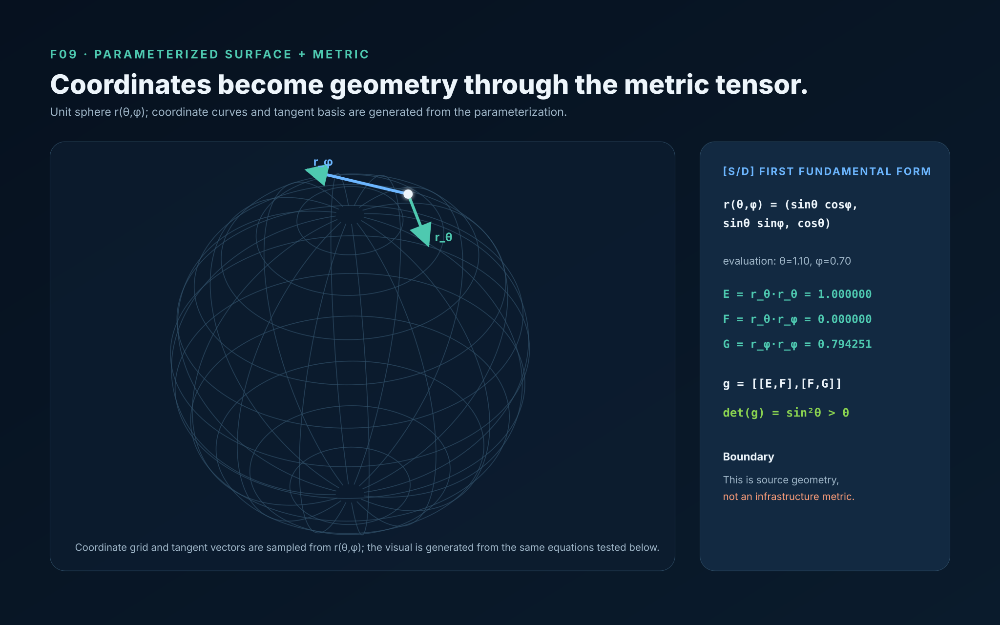</p>

### F10 — Gaussian Curvature Field

<p align="center">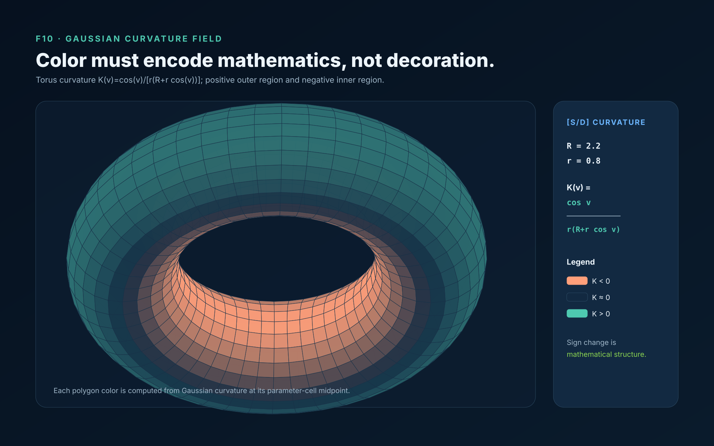</p>

### F11 — Computed Geodesics

<p align="center">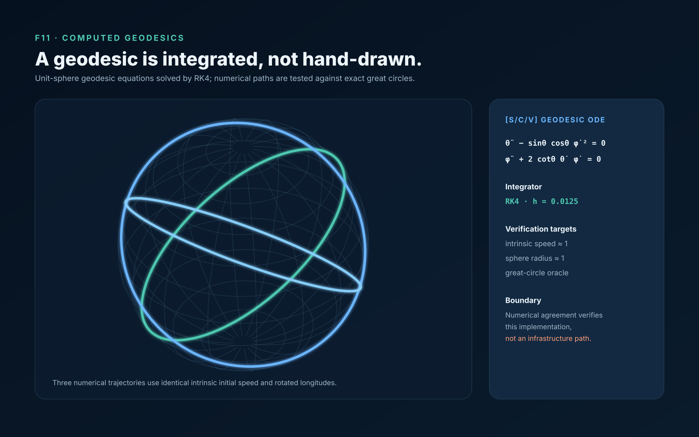</p>

### F12 — Tangent Vector Field

<p align="center">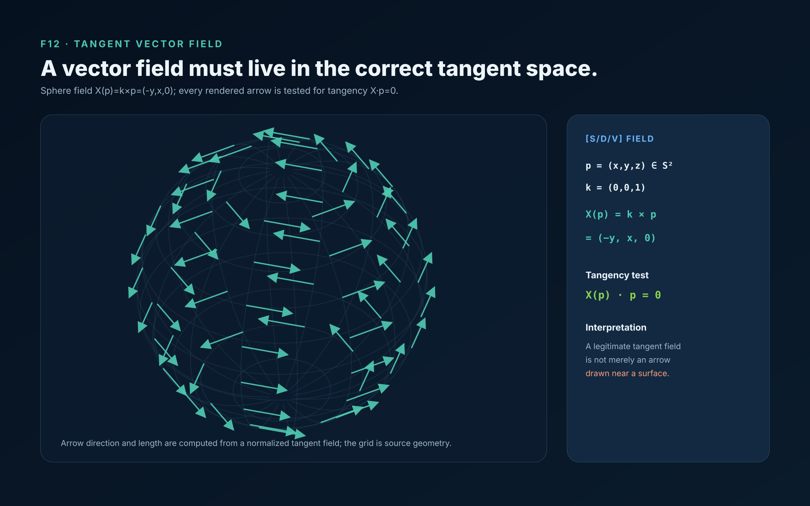</p>

### F13 — Laplace–Beltrami Heat Flow

<p align="center">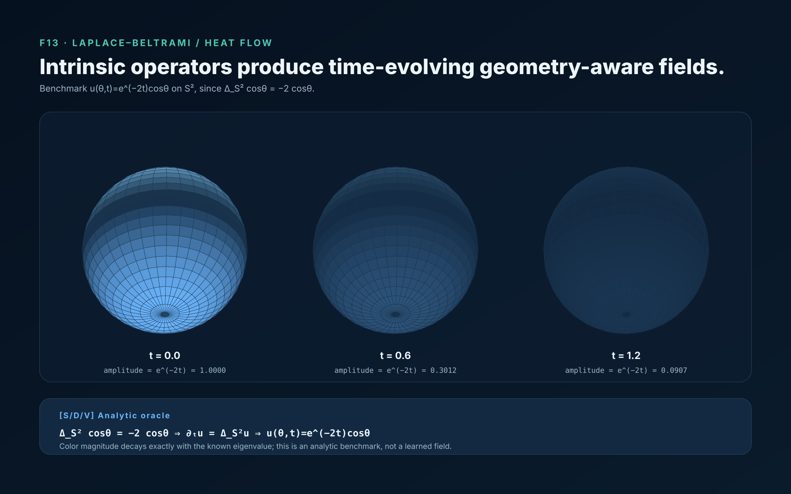</p>

### F14 — Infrastructure Viability Geometry

<p align="center"></p>

## Reproduce and audit

```bash
npm run verify:dg
npm run verify:f14
npm run verify:math-art
npm run audit:release
```

The CI audit additionally rasterizes every governed master at 3840 px width and verifies the derivative dimensions and PNG structure. Passing those checks verifies the implementation and rendering pipeline; it does not create field validation.
